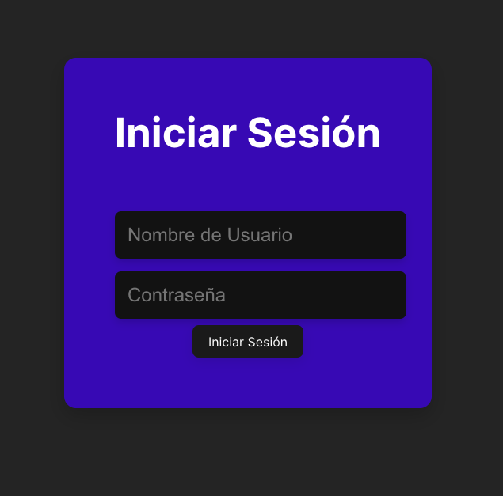

# Inicio de sesión con React + Vite
clonar el proyecto:
```bash
git clone https://github.com/emersonxinay/sesion_basic_react_vite.git
```
ingresar a la carpeta creada al clonar el proyecto
```bash
cd nombre_proyecto
```
instalar las dependencias con npm 
```bash
npm install 
````
correr el proyecto 
```bash
npm run dev 
```

## demo img 


